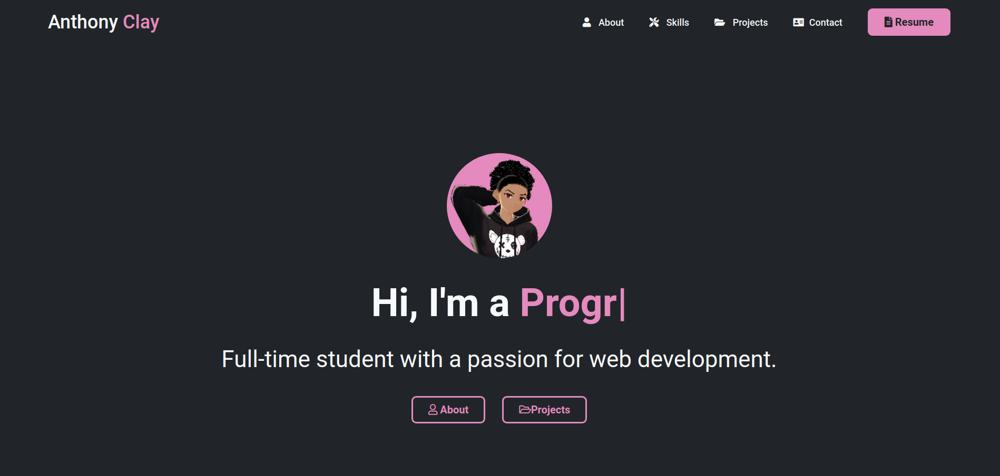

# My Portfolio

This project was created to practice my HTML and CSS skills as well as show off some of my projects.

🔗 **Live version of this website available [HERE](https://aclaystudios.com/)**

### Outcome of this project:

- Deepened knowledge of **HTML** and **CSS**.
- Improved **CSS Grid** understanding and usage.
- Mobile friendly and responsive designs
- Show of my portfolio of projects that I have worked on

### Preview of the web page:

